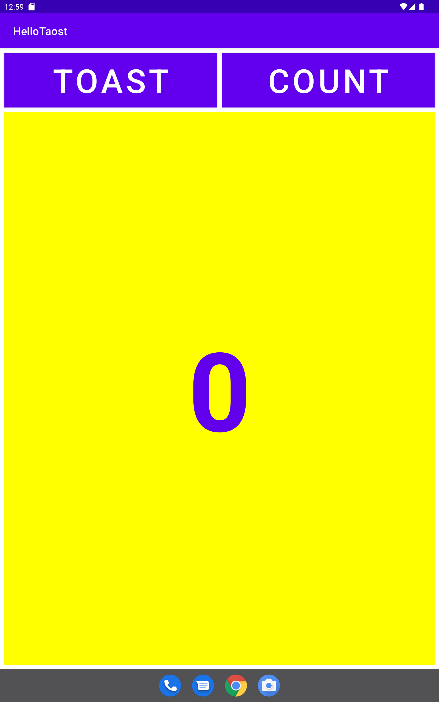

# The-layout-editor

### Hello Toast

layout in a horizontal orientation

layout variant for tablets

landscape orientation

## Task 2

Linear layout

## Task 3

Relative layout

## Challenge

## Homework

In landscape orientation

In x-large

## Answer these questions

### Question 1

Which two layout constraint attributes on the Zero Button position it vertically equal distance between the other two Button elements? (Pick 2 answers.)

Ans - android:layout_marginBottom="8dp"
android:layout_marginTop="8dp"

### Question 2

Which layout constraint attribute on the Zero Button positions it horizontally in alignment with the other two Button elements?

Ans - app:layout_constraintLeft_toLeftOf="parent"

### Question 3

What is the correct signature for a method used with the android:onClick XML attribute?

Ans - public void callMethod(View view)

### Question 4

The click handler for the Count Button starts with the following method signature:
public void countUp(View view)
Which of the following techniques is more efficient to use within this handler to change the Button element's background color? Choose one:

Ans - Use the view parameter that is passed to the click handler with setBackgroundColor(): view.setBackgroundColor()
